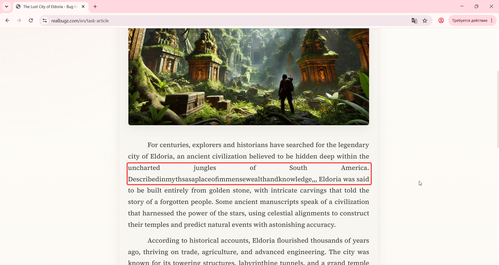

# Title: Windows 11  - Article - Text Block - Formatting, spelling, and punctuation errors present

# Issue Classifications
* **OS:** Windows 11
* **Browser:** Google Chrome (Latest version)
* **Type:** Content
* **Severity:** Medium

## Steps to Reproduce:
**Prerequisites:** Read the task requirements on https://www.realbugz.com/en/requirements-for-article
1. Open https://www.realbugz.com/en/task-article.
2. Scroll down to the main text body and examine the text paragraphs.

## Expected Result:
The text block should be correctly formatted according to standard grammar rules and layout requirements (single spaces between words, no typos, correct punctuation).

## Actual Result:
One of the text blocks contains multiple formatting issues: words are written together without spaces, there are massive gaps (excessive spaces) between other words, and an excessive number of commas is used in one place.

## Attachments:

