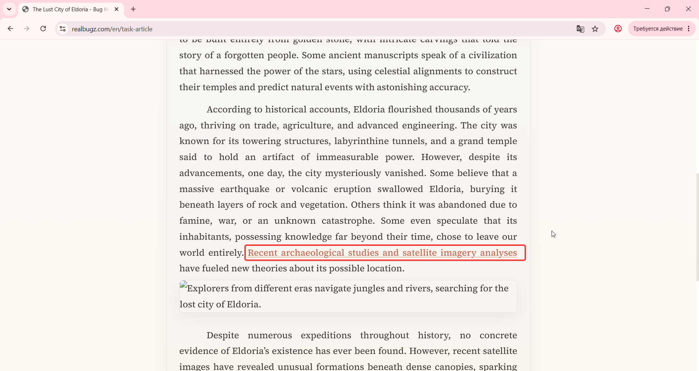
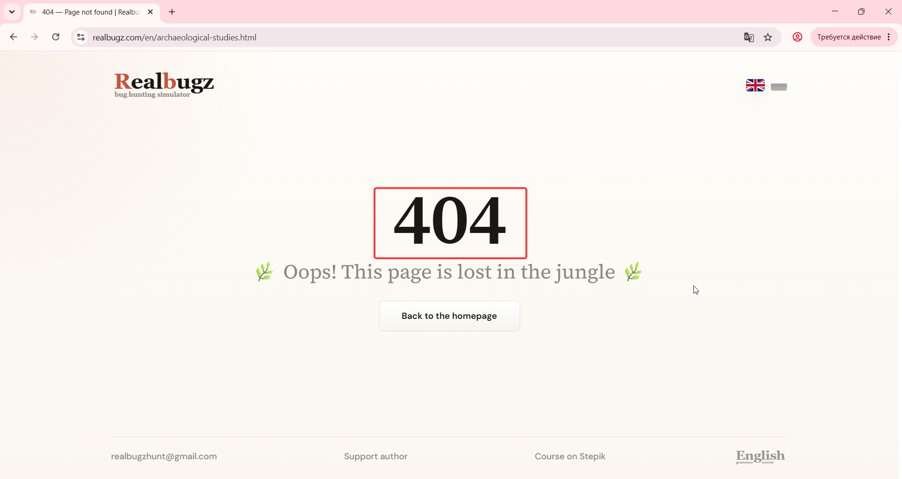

# Title: Windows 11 - Article - Clicking the link redirects to 404 Error page

# Issue Classifications
* **OS:** Windows 11
* **Browser:** Google Chrome (Latest version)
* **Type:** Functional
* **Severity:** Medium

## Steps to Reproduce:
1. Open https://www.realbugz.com/en/task-article.
2. Locate the highlighted text formatted as a hyperlink within the article body.
3. Click on the hyperlink.

## Expected Result:
The hyperlink should redirect the user to a valid target page specified in the requirements.

## Actual Result:
The user is redirected to a non-existent page, and a "404 Not Found" server error message is displayed.

## Error Message:
404 Error Link

## Attachments:

