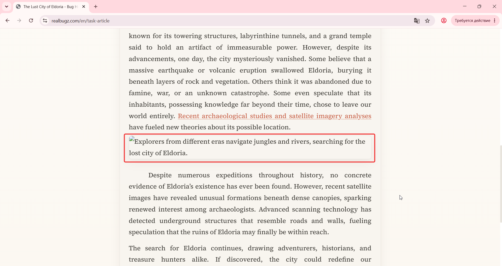

# Title: Windows 11 – Article – Broken image icon overlaps caption text

# Issue Classifications
* **OS:** Windows 11
* **Browser:** Google Chrome (Latest version)
* **Type:** Visual
* **Severity:** Low

## Steps to Reproduce:
1. Open Open https://www.realbugz.com/en/task-article.
2. Scroll down to the illustration section.

## Expected Result:
The illustration image should load correctly. The caption text should be placed neatly below the image without any overlap or visual layout issues.

## Actual Result:
The image fails to load, and a default broken image placeholder icon is displayed instead. This placeholder icon directly overlaps the caption text underneath it, making it unreadable.

## Attachments:

