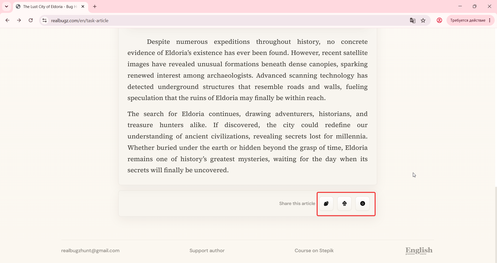

# Title: Windows 11 – Article – Social share buttons do not respond

# Issue Classifications
* **OS:** Windows 11
* **Browser:** Google Chrome (Latest version)
* **Type:** Functional
* **Severity:** Medium

## Steps to Reproduce:
**Prerequisites:** Read the task requirements on https://www.realbugz.com/en/requirements-for-article
1. Open https://www.realbugz.com/en/task-article.
2. Scroll down to the "Share article" section at the bottom.
3. Click on any social media button (Facebook, Telegram, etc.).

## Expected Result:
Clicking a social media button should open a standard sharing pop-up window or redirect the user to publish the article on the selected platform.

## Actual Result:
There is absolutely no response from the user interface. No sharing pop-up windows appear, and no actions are triggered.

## Attachments:

