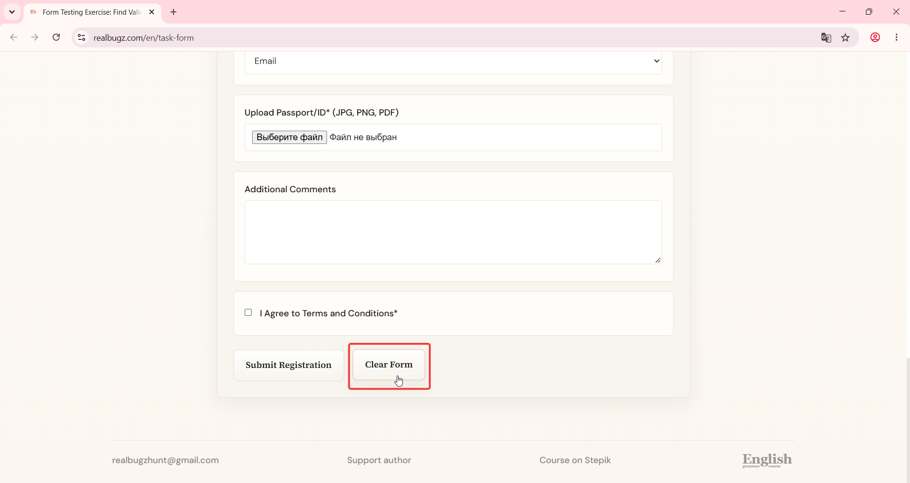

# Title: Windows 11 – Form – Clear button does not trigger data clearance confirmation message

# Issue Classifications
* **OS:** Windows 11
* **Browser:** Google Chrome (Latest version)
* **Type:** Visual
* **Severity:** Low

## Steps to Reproduce:
Prerequisites: Read the task requirements on https://www.realbugz.com/en/requirements-for-form
1. Open https://www.realbugz.com/en/task-form
2. Scroll down to the bottom of the page.
3. Locate the form clear button.
4. Click on the button.

## Expected Result:
Clicking the clear button should display a confirmation message that data has been cleared.

## Actual Result:
Data is cleared without any notification or confirmation message.

## Attachments:

