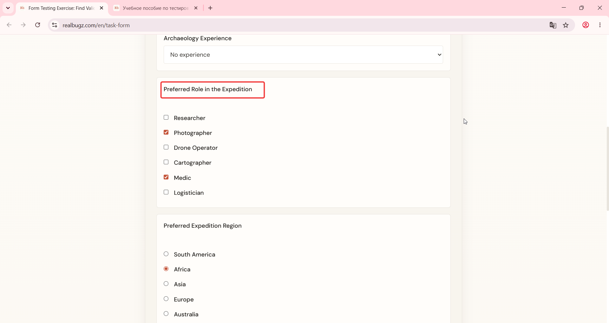

# Title: Windows 11 – Form – The mandatory "Preferred Expedition Region" field is not marked with an asterisk (*).

# Issue Classifications
* **OS:** Windows 11
* **Browser:** Google Chrome (Latest version)
* **Type:** Visual
* **Severity:** Low

## Steps to Reproduce:
Prerequisites: Read the task requirements on https://www.realbugz.com/en/requirements-for-form
1. Open https://www.realbugz.com/en/task-form.
2. Scroll down to the "Preferred Expedition Region" field.
3. Observe the field label.

## Expected Result:
The "Preferred Expedition Region" field should have an asterisk (*) indicator since it is required.

## Actual Result:
The asterisk indicator is missing, but the form cannot be submitted without filling this field.

## Attachments:

