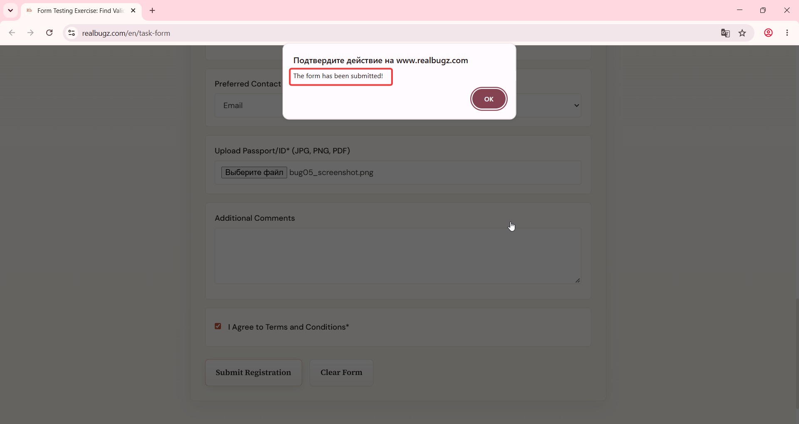
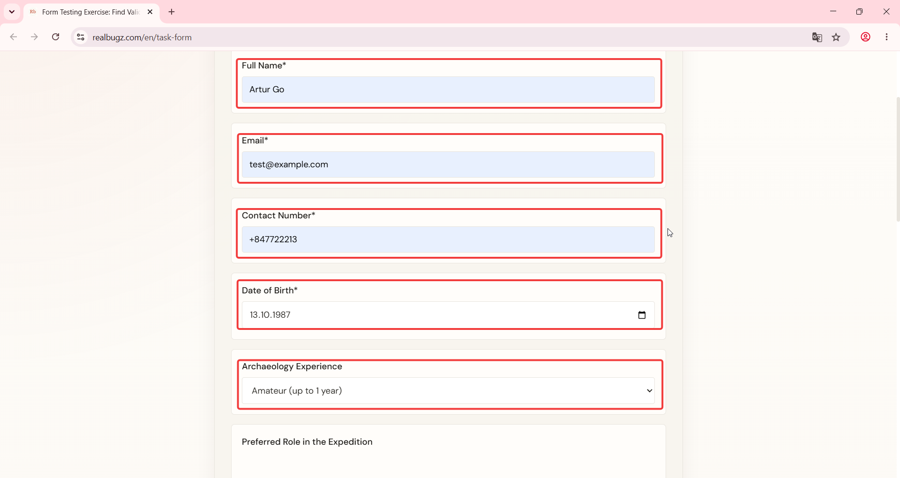

# Title: Windows 11 – Form – Form fields do not auto-clear after successful submission

# Issue Classifications
* **OS:** Windows 11
* **Browser:** Google Chrome (Latest version)
* **Type:** Functional
* **Severity:** Low

## Steps to Reproduce:
**Prerequisites:** Read the task requirements on https://www.realbugz.com/en/requirements-for-form
1. Open https://www.realbugz.com/en/task-form.
2. Fill out all required fields with valid data.
3. Scroll to the bottom.
4. Click the Submit Registration  button.
5. Observe the form fields after successful submission message.

## Expected Result:
All inputs and selected options should reset to empty defaults after a successful form submission.

## Actual Result:
Input fields retain the previously entered data after submission.

## Attachments:
### Video demonstration:
https://github.com/user-attachments/assets/de4dc3c2-d9bc-4d23-b461-faab1543851f

### Actual Result Screenshot:

