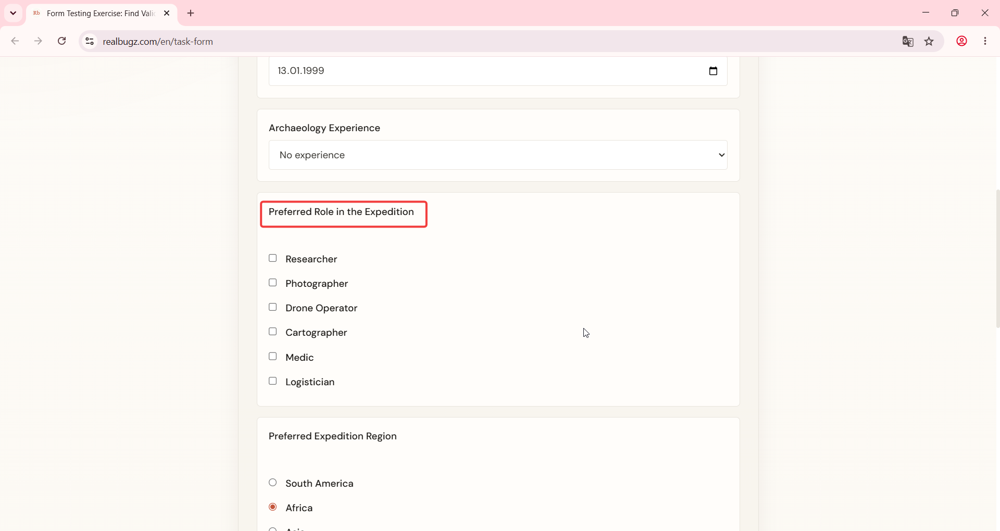
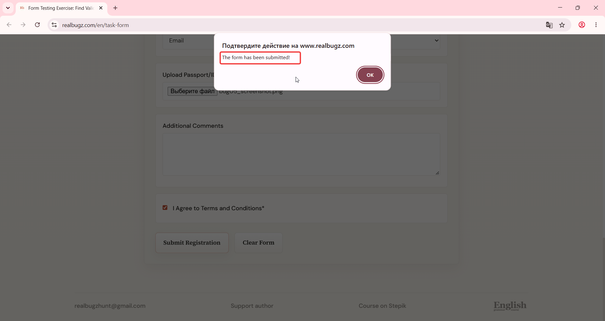

# Title: Windows 11 – Form – Preferred Role field is missing validation and asterisk indicator

# Issue Classifications
* **OS:** Windows 11
* **Browser:** Google Chrome (Latest version)
* **Type:** Functional
* **Severity:** Medium

## Steps to Reproduce:
1. Open https://www.realbugz.com/en/task-form.
2. Fill out all fields with valid data except "Preferred Role in the Expedition" (leave it empty).
3. Click the submit button.

## Expected Result:
"Preferred Role in the Expedition" should be a required field marked with an asterisk (*), and the submission should be blocked if it is empty.

## Actual Result:
The field is missing both the asterisk indicator and validation constraints, allowing form submission with an empty role.

## Attachments:
### Video demonstration:
https://github.com/user-attachments/assets/b0dc6b63-f83c-4f4b-8a0b-d489e9cd2544

### Actual Result Screenshot:

