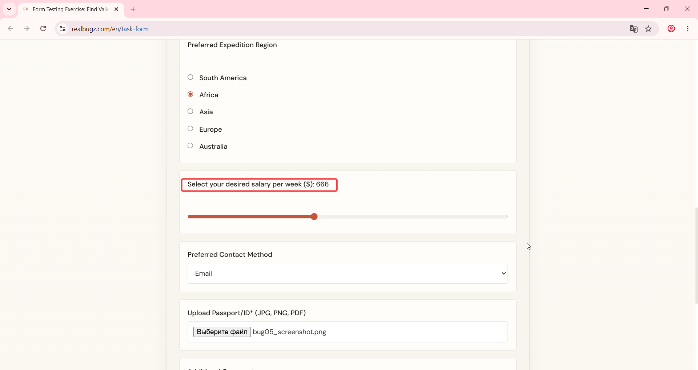

# Title: Windows 11 – Form – Salary field step increment is not set to 10

# Issue Classifications
* **OS:** Windows 11
* **Browser:** Google Chrome (Latest version)
* **Type:** Functional
* **Severity:** Low

## Steps to Reproduce:
Prerequisites: Read the task requirements on https://www.realbugz.com/en/requirements-for-form
1. Open https://www.realbugz.com/en/task-form.
2. Locate the "Select your desired salary per week ($)" field.
3. Click the up or down arrows (spinner controls) to change the value.

## Expected Result:
The step attribute for the currency spinner should be equal to 10 as per requirements.

## Actual Result:
The field increment step is different from the requested value of 10.

## Attachments:
### Video demonstration:
https://github.com/user-attachments/assets/c808522a-8b95-4977-973c-1cab67ce39ee
### Actual Result Screenshot:

