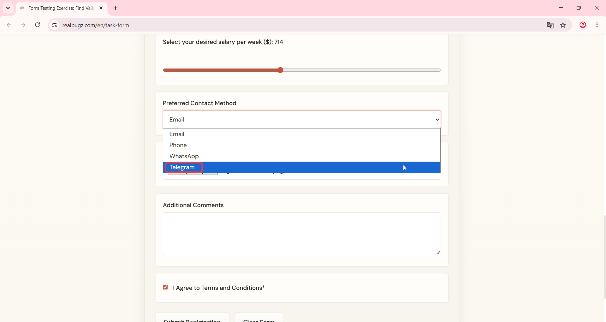

# Title: Windows 11 – Form – Preferred Contact Method dropdown displays Telegram instead of SMS

# Issue Classifications
* **OS:** Windows 11
* **Browser:** Google Chrome (Latest version)
* **Type:** Content
* **Severity:** Low

## Steps to Reproduce:
**Prerequisites:** Read the task requirements on https://www.realbugz.com/en/requirements-for-form
1. Open https://www.realbugz.com/en/task-form.
2. Scroll to the "Preferred Contact Method" field.
3. Click on the dropdown menu to expand options.

## Expected Result:
The dropdown list should display the options: Email, Phone, WhatsApp, SMS.

## Actual Result:
The dropdown displays "Telegram" option instead of the required "SMS".

## Attachments:

