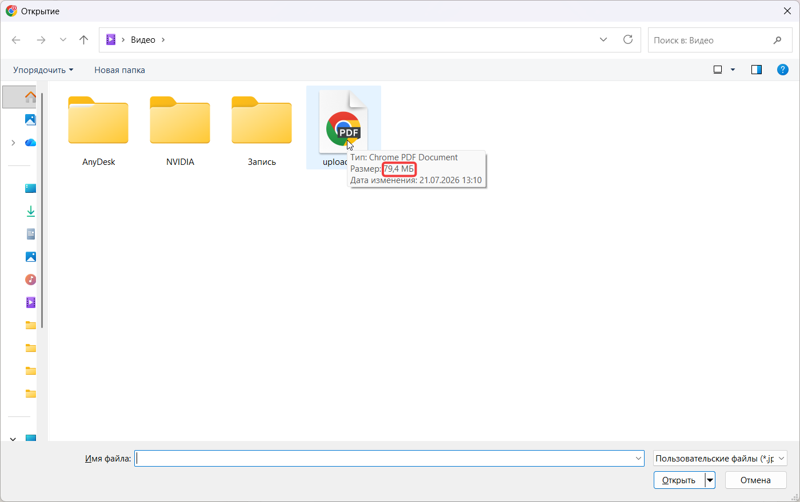
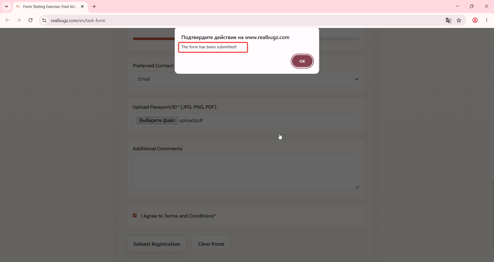

# Title: Windows 11 – Form – Passport upload accepts files exceeding 5MB limit

# Issue Classifications
* **OS:** Windows 11
* **Browser:** Google Chrome (Latest version)
* **Type:** Functional
* **Severity:** Medium

## Steps to Reproduce:
1. Open https://www.realbugz.com/en/task-form.
2. Locate the "Upload Passport/ID*" field.
3. Select and upload a file that is larger than 5 MB (e.g., 6 MB JPG or PDF).
4. Fill out other required fields and click submit.

## Expected Result:
The input should reject files larger than 5 MB, block form submission, and show a validation error.

## Actual Result:
Files larger than 5 MB are successfully uploaded and the form submits without validation warnings.

## Attachments:
### Video demonstration:
https://github.com/user-attachments/assets/25f74586-6426-4bfb-84c8-61d003aa9e02
### Actual Result Screenshot:

