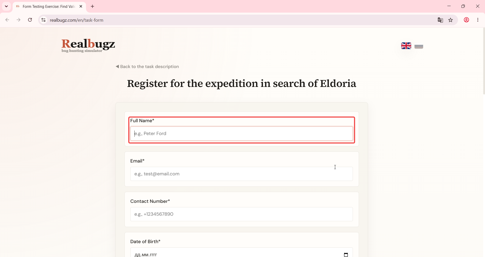

# Title: Windows 11 – Form – Missing error text messages for empty required fields

# Issue Classifications
* **OS:** Windows 11
* **Browser:** Google Chrome (Latest version)
* **Type:** Visual
* **Severity:** Low

## Steps to Reproduce:
**Prerequisites:** Read the task requirements on https://www.realbugz.com/en/requirements-for-form
1. https://www.realbugz.com/en/task-form.
2. Leave required fields empty and click the submit button.
3. Observe the validation response on the empty fields.

## Expected Result:
Empty required fields should trigger an explicit text error message alongside the red border highlighting.

## Actual Result:
The system only highlights the container red but provides no explanatory text message.

## Attachments:

