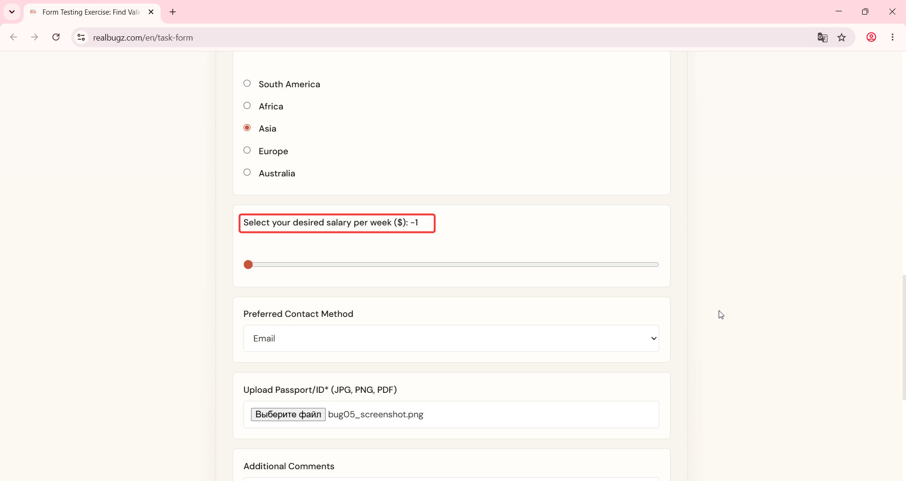
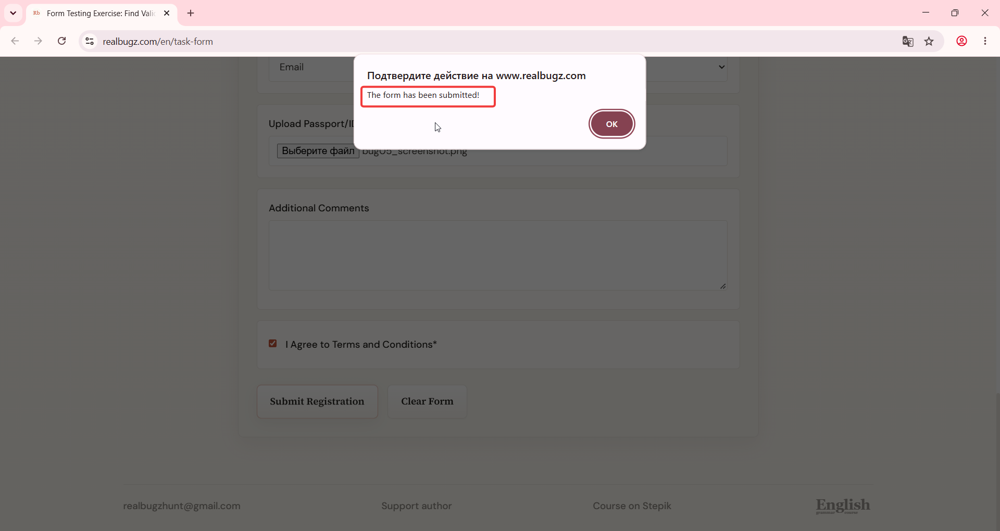

# Title: Windows 11 – Form – Salary field accepts negative values less than zero

# Issue Classifications
* **OS:** Windows 11
* **Browser:** Google Chrome (Latest version)
* **Type:** Functional
* **Severity:** Medium

## Steps to Reproduce:
1. Open https://www.realbugz.com/en/task-form.
2. Locate the "Select your desired salary per week ($)" range slider.
3. Drag the slider controller all the way to the left (value decreases to -1).
4. Fill out the rest of the required fields with valid data.
5. Click the submit button.

## Expected Result:
The salary field should reject negative numeric inputs. The system should block form submission and display a validation error message.

## Actual Result:
The field accepts negative values without any prevention. The form is successfully submitted with a negative salary value.

## Attachments:

