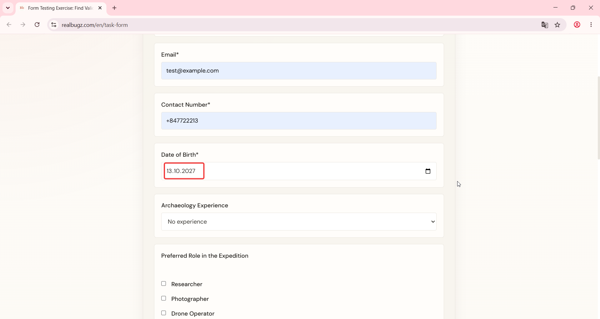
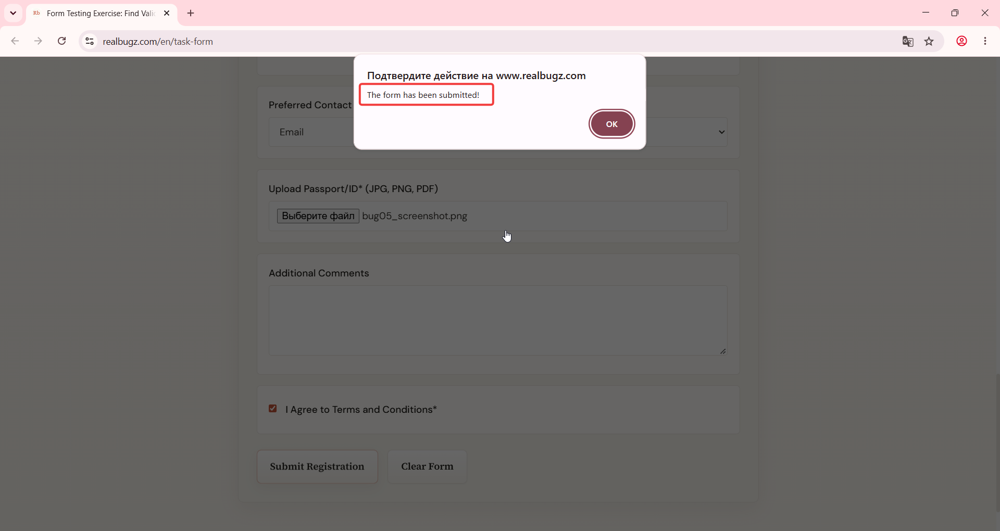

# Title: Windows 11 – Form – Date of Birth field accepts ages under 18 or over 70

# Issue Classifications
* **OS:** Windows 11
* **Browser:** Google Chrome (Latest version)
* **Type:** Functional
* **Severity:** High

## Steps to Reproduce:
**Prerequisites:** Read the task requirements on https://www.realbugz.com/en/requirements-for-form
1. Open https://www.realbugz.com/en/task-form.
2. Locate the "Date of Birth" field.
3. Select or type a date that makes the user under 18 or over 70 years old.
4. Fill out all other required fields with valid data.
5. Click the submit button.

## Expected Result:
The system should validate the user's age. Form submission should be blocked for users outside the legal limits (under 18 or over 70), and an explicit error text should appear.

## Actual Result:
The Date of Birth field accepts any date values. The registration form submits successfully, allowing users outside the age criteria to sign up.

## Attachments:

