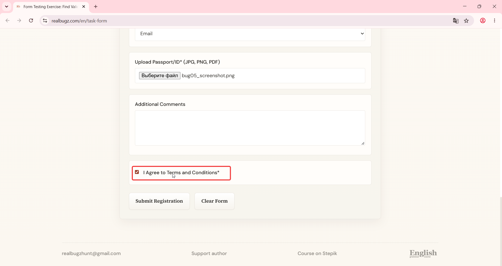

# Title: Windows 11 – Form – "Terms of Use" text is not styled as interactive and missing tooltip

# Issue Classifications
* **OS:** Windows 11
* **Browser:** Google Chrome (Latest version)
* **Type:** Visual
* **Severity:** Low

## Steps to Reproduce:
**Prerequisites:** Read the task requirements on https://www.realbugz.com/en/requirements-for-form.
1. Open https://www.realbugz.com/en/task-form.
2. Scroll down to the consent checkbox text: "I agree to the Terms of Use".
3. Hover the mouse cursor over the phrase "Terms of Use".
4. Observe the text styling and UI response.

## Expected Result:
The words "Terms of Use" should be styled as an interactive link (e.g., highlighted or underlined). Hovering over them should trigger a tooltip explaining data usage.

## Actual Result:
The text lacks any interactive styling (appears as plain text) and no explanatory tooltip is displayed upon hovering.

## Attachments:

